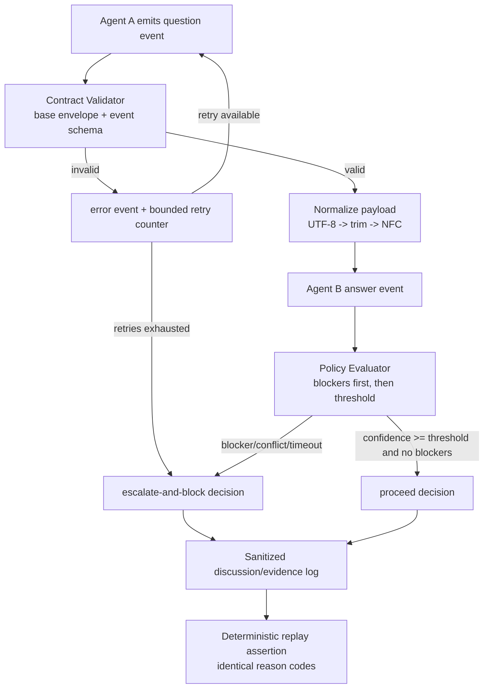

# Phase 8: Multi-Agent Spec/Discuss Architecture Contract - Research

**Researched:** 2026-07-19
**Domain:** Deterministic multi-agent ask/answer contract design for spec/discuss orchestration
**Confidence:** MEDIUM

<user_constraints>
## User Constraints (from CONTEXT.md)

### Locked Decisions
- **D-01:** Use per-event schemas with a shared base envelope.
- **D-02:** Enforce semantic major schema version in payload and fail closed on unknown major versions.
- **D-03:** Normalize free-text fields as UTF-8 strings with trim and NFC normalization before validation/decisioning.
- **D-04:** Preserve SPEC lock precedence: `escalate-and-block` overrides `proceed` whenever any blocking risk/conflict signal is present.
- **D-05:** Proceed only when `confidence >= threshold` and no blockers exist.
- **D-06:** Invalid or empty Agent B answer payload triggers bounded retries, then `escalate-and-block`.
- **D-07:** Preserve SPEC lock for deterministic reason-code outputs (stable replay/test assertions).
- **D-08:** Place the runnable phase-8 prototype in orchestration seam territory (root `flow/orchestrator/`), not governance-first or lifecycle-first.
- **D-09:** Expose prototype through a feature-flagged seam in `flow/cli.mjs` with explicit invocation mode for deterministic testing.
- **D-10:** Prototype output format follows locked SPEC contract: structured decision output suitable for deterministic replay checks.
- **D-11:** Mandatory envelope fields: `schemaVersion`, `runId`, `phaseNumber`, `eventType`, `timestampIso`, `correlationId`, `agentRole`, `confidence`.
- **D-12:** Do not persist raw provider response bodies; store sanitized provider metadata only (prohibition-safe logging).
- **D-13:** Validation remains fail-closed and emits explicit error events for malformed payloads.

### Claude's Discretion
- Prototype module placement details and naming are delegated to Claude, constrained by D-08 and existing root `flow/` conventions.

### Deferred Ideas (OUT OF SCOPE)
- Multi-agent debate behavior (3+ agents) remains deferred beyond phase 8.
- If preferred later, free-text-only prototype decision output can be reconsidered via a formal SPEC revision before planning/execution.
</user_constraints>

<phase_requirements>
## Phase Requirements

| ID | Description | Research Support |
|----|-------------|------------------|
| INTD-06 | Deterministic independent ask/answer contract for spec/discuss with explicit role boundaries. [ASSUMED] | Event-family contract, role authority rules, and deterministic replay reason codes in Architecture Patterns + Common Pitfalls. [VERIFIED: codebase grep] |
| CONS-01 | Deterministic consensus/decision policy with bounded rounds and explicit escalation behavior. [ASSUMED] | Stop/escalate precedence, timeout policy, bounded retries, and failure-mode matrix recommendations. [CITED: https://nodejs.org/api/globals.html#static-method-abortsignaltimeoutdelay] |
| SAFE-04 | Fail-closed safety behavior for malformed payloads, no-response windows, and scope violations. [ASSUMED] | Strict schema validation, unknown-major rejection, malformed event errors, and escalation-and-block outcomes. [VERIFIED: codebase grep] |
</phase_requirements>

## Project Constraints (from CLAUDE.md)

- Reliability over autonomy: architecture must prefer deterministic, verifiable control flow. [CITED: .claude/CLAUDE.md]
- Workflow-first, not prompt-first: routing and validation must own control flow. [CITED: .claude/CLAUDE.md]
- Compose Pi/GSD rather than reimplement lifecycle internals. [CITED: .claude/CLAUDE.md]
- Keep implementation in root `flow/` with thin external bridge boundaries. [CITED: .planning/ROADMAP.md]
- Use GSD workflow surfaces and avoid direct lifecycle duplication. [CITED: .claude/CLAUDE.md]
- Security and logging constraints: do not persist chain-of-thought and do not log secrets/provider credentials. [CITED: .planning/phases/08-multi-agent-spec-discuss-architecture-contract/08-SPEC.md]

## Summary

Phase 8 should be planned as a contract-hardening slice, not a runtime-isolation slice: the repository already has deterministic interception metadata, context-pack allowlisting, fail-closed answer validation, and escalation reasons, but these are spread across orchestration/lifecycle/governance modules and are not yet unified into a dedicated spec/discuss event contract. [VERIFIED: codebase grep] The highest-leverage plan is to introduce a versioned event-family contract in `flow/orchestrator/` and a deterministic decision engine prototype reachable via a feature-flagged CLI seam. [VERIFIED: codebase grep]

Determinism requirements are already culturally aligned with current code: `schemaVersion: 1` appears repeatedly in manifests and governance outputs, escalation reasons are structured, and tests assert fail-closed behavior for invalid responder payloads. [VERIFIED: codebase grep] This allows Phase 8 to stay scoped to policy/schema contract and deterministic replay without introducing provider SDKs, independent processes, or transport protocols (all deferred). [CITED: .planning/phases/08-multi-agent-spec-discuss-architecture-contract/08-SPEC.md]

For implementation choices, use JSON Schema Draft 2020-12 contracts with Ajv strict compilation for event validation, and use `AbortSignal.timeout()` plus bounded retry counters for deterministic timeout behavior. [CITED: https://ajv.js.org/json-schema.html] [CITED: https://ajv.js.org/strict-mode.html] [CITED: https://nodejs.org/api/globals.html#static-method-abortsignaltimeoutdelay] Normalize text as UTF-8 then NFC before policy evaluation to enforce D-03 consistently. [CITED: https://nodejs.org/api/util.html#class-utiltextdecoder] [CITED: https://developer.mozilla.org/en-US/docs/Web/JavaScript/Reference/Global_Objects/String/normalize]

**Primary recommendation:** Implement a fail-closed event-contract module plus deterministic decision prototype in `flow/orchestrator/`, wired through a feature-flag path in `flow/cli.mjs`, with strict schema validation, explicit timeout/error events, and stable reason-code outputs. [VERIFIED: codebase grep]

## Architectural Responsibility Map

| Capability | Primary Tier | Secondary Tier | Rationale |
|------------|-------------|----------------|-----------|
| Intercept spec/discuss question rounds | Orchestrator | CLI | Interception rules are built in `flow/orchestrator/interception.mjs`; CLI only invokes orchestration path. [VERIFIED: codebase grep] |
| Build deterministic context payloads | Orchestrator | File system artifacts | Context pack generation and artifact allowlist already live in `flow/orchestrator/context-pack.mjs`. [VERIFIED: codebase grep] |
| Validate multi-agent event schemas | Orchestrator contract module | Lifecycle validator pattern | Existing answer validator is lifecycle-scoped; phase contract validator should be orchestrator-scoped for spec/discuss flow. [VERIFIED: codebase grep] |
| Evaluate proceed vs escalate-and-block | Orchestrator policy engine | Governance escalation patterns | Existing governance evaluator provides reason-pattern baseline, but phase-8 policy must be scoped to ask/answer contract. [VERIFIED: codebase grep] |
| Persist sanitized discussion evidence | Governance | Orchestrator | Discussion log persistence already in governance; orchestrator should pass sanitized event records only. [VERIFIED: codebase grep] |
| Feature-flag runnable prototype entry | CLI | Orchestrator | `flow/cli.mjs` is current seam for orchestration modes and is the correct invocation boundary. [VERIFIED: codebase grep] |

## Standard Stack

### Core
| Library | Version | Purpose | Why Standard |
|---------|---------|---------|--------------|
| `ajv` [VERIFIED: npm registry] | 8.20.0 (npm modified 2026-04-24) [VERIFIED: npm registry] | Compile and enforce versioned JSON Schema contracts for all phase-8 event types. [CITED: https://ajv.js.org/json-schema.html] | Strict-mode schema compilation supports fail-closed contract behavior over ambiguous schemas. [CITED: https://ajv.js.org/strict-mode.html] |
| Node.js global `AbortSignal.timeout` [CITED: https://nodejs.org/api/globals.html#static-method-abortsignaltimeoutdelay] | Available in current runtime (v24.14.0 installed) [VERIFIED: codebase grep] | Deterministic timeout windows and explicit timeout events for no-response windows. [CITED: https://nodejs.org/api/globals.html#class-abortsignal] | Native API, no extra dependency, deterministic abort semantics. [CITED: https://nodejs.org/api/globals.html#class-abortsignal] |

### Supporting
| Library | Version | Purpose | When to Use |
|---------|---------|---------|-------------|
| `ajv-formats` [VERIFIED: npm registry] | 3.0.1 (npm modified 2024-03-30) [VERIFIED: npm registry] | Optional format assertions (UUID, date-time) in event envelope fields if contract requires them. [CITED: https://ajv.js.org/json-schema.html] | Use only when format validation is explicitly required for envelope fields. [CITED: https://ajv.js.org/strict-mode.html] |
| `TextDecoder` (Node util/global) [CITED: https://nodejs.org/api/util.html#class-utiltextdecoder] | Runtime-provided | UTF-8 decode path before trim+NFC normalization for free-text fields. [CITED: https://nodejs.org/api/util.html#textdecoderdecodeinput-options] | Use when ingesting non-string byte payloads. [ASSUMED] |

### Alternatives Considered
| Instead of | Could Use | Tradeoff |
|------------|-----------|----------|
| `ajv` | Custom validators in plain JS | Faster to start, but high drift/edge-case risk and weaker schema evolution guarantees; violates "don't hand-roll" for event contracts. [ASSUMED] |
| JSON Schema 2020-12 | ad-hoc per-event object checks | Lower complexity short-term, but no standardized schema-version behavior and weaker tooling. [ASSUMED] |

**Installation:**
```bash
npm install ajv ajv-formats
```

**Version verification:**
```bash
npm view ajv version
npm view ajv-formats version
```

## Package Legitimacy Audit

| Package | Registry | Age | Downloads | Source Repo | Verdict | Disposition |
|---------|----------|-----|-----------|-------------|---------|-------------|
| ajv | npm | ~10+ years (active; modified 2026-04-24) | 315,469,430/week | https://github.com/ajv-validator/ajv | OK | Approved |
| ajv-formats | npm | ~5+ years (modified 2024-03-30) | 101,967,177/week | https://github.com/ajv-validator/ajv-formats | OK | Approved |

**Packages removed due to [SLOP] verdict:** none
**Packages flagged as suspicious [SUS]:** none

## Architecture Patterns

### System Architecture Diagram



### Recommended Project Structure

```text
flow/
├── orchestrator/
│   ├── debate-contract.mjs        # schema registry + normalization + contract validation
│   ├── debate-policy.mjs          # proceed/escalate deterministic decision engine
│   ├── debate-prototype.mjs       # runnable transcript-driven prototype
│   ├── interception.mjs           # existing interception metadata seam
│   └── context-pack.mjs           # existing deterministic context seam
├── governance/
│   └── discussion-log.mjs         # existing persistence path (sanitized writes only)
├── cli.mjs                        # feature-flagged prototype invocation path
└── tests/
    ├── orchestrator-debate-contract.test.mjs
    ├── orchestrator-debate-policy.test.mjs
    └── orchestrator-debate-prototype.test.mjs
```

### Pattern 1: Shared Envelope + Event Family Registry
**What:** Define one base envelope schema (`schemaVersion`, `runId`, `phaseNumber`, `eventType`, `timestampIso`, `correlationId`, `agentRole`, `confidence`) plus per-event schemas (`proposal`, `critique`, `revision`, `vote`, `consensus`, `timeout`, `error`) keyed by `eventType`. [VERIFIED: codebase grep]
**When to use:** Whenever event classes share deterministic metadata and must fail closed on unknown major versions. [ASSUMED]
**Example:**
```typescript
// Source: repository pattern + JSON Schema 2020-12 docs
const SUPPORTED_MAJOR = 1;

export function assertSchemaMajor(version) {
  const major = Number(String(version).split(".")[0]);
  if (!Number.isInteger(major) || major !== SUPPORTED_MAJOR) {
    throw new Error(`unsupported_schema_major:${version}`);
  }
}
```

### Pattern 2: Deterministic Stop/Escalate Precedence
**What:** Compute blockers first (`malformed`, `timeout`, `conflict`, `risk >= threshold`) and always emit `escalate-and-block` if any blocker exists; only evaluate proceed path when blockers are empty. [CITED: .planning/phases/08-multi-agent-spec-discuss-architecture-contract/08-CONTEXT.md]
**When to use:** Any spec/discuss ask/answer round where Agent A controls policy state transitions. [CITED: .planning/phases/08-multi-agent-spec-discuss-architecture-contract/08-SPEC.md]
**Example:**
```typescript
// Source: escalation precedence in phase lock
function decide({ blockers, confidence, threshold }) {
  if (blockers.length > 0) {
    return { decision: "escalate-and-block", reasonCodes: blockers.sort() };
  }
  if (confidence >= threshold) {
    return { decision: "proceed", reasonCodes: ["threshold_satisfied"] };
  }
  return { decision: "escalate-and-block", reasonCodes: ["low_confidence"] };
}
```

### Pattern 3: Timeout as First-Class Event
**What:** Use `AbortSignal.timeout(ms)` and emit deterministic `timeout` event with stable reason code (`agent_b_timeout`) instead of implicit exceptions. [CITED: https://nodejs.org/api/globals.html#static-method-abortsignaltimeoutdelay]
**When to use:** Waiting for Agent B answer payload in bounded round windows. [ASSUMED]
**Example:**
```typescript
// Source: Node AbortSignal docs
const signal = AbortSignal.timeout(timeoutMs);
signal.addEventListener("abort", () => {
  emitEvent({ eventType: "timeout", reasonCode: "agent_b_timeout" });
}, { once: true });
```

### Anti-Patterns to Avoid
- **Role inversion:** Allowing Agent B to issue control directives (stop/proceed/escalate) instead of answer-only output. [CITED: .planning/phases/08-multi-agent-spec-discuss-architecture-contract/08-SPEC.md]
- **Schema drift by silent acceptance:** Accepting unknown major schema versions or unknown event types. [CITED: .planning/phases/08-multi-agent-spec-discuss-architecture-contract/08-CONTEXT.md]
- **Non-deterministic reason ordering:** Emitting unordered reason arrays that break replay assertions. [ASSUMED]
- **Raw provider payload persistence:** Storing full provider response bodies in logs/evidence. [CITED: .planning/phases/08-multi-agent-spec-discuss-architecture-contract/08-CONTEXT.md]

## Don't Hand-Roll

| Problem | Don't Build | Use Instead | Why |
|---------|-------------|-------------|-----|
| Draft-aware schema compiler | Custom recursive validator | `ajv` [VERIFIED: npm registry] | Handles JSON Schema dialect mechanics and strict-mode protections better than ad-hoc code. [CITED: https://ajv.js.org/json-schema.html] |
| Timeout/cancellation orchestration | Manual timer + boolean flags | `AbortSignal.timeout()` + abort reasons | Native deterministic cancellation semantics and simpler leak-safe listener behavior. [CITED: https://nodejs.org/api/globals.html#event-abort] |
| Unicode normalization rules | Custom normalization maps | `String.prototype.normalize("NFC")` | Standardized Unicode normalization behavior and canonical equivalence handling. [CITED: https://developer.mozilla.org/en-US/docs/Web/JavaScript/Reference/Global_Objects/String/normalize] |

**Key insight:** Contract code should focus on deterministic policy and boundary ownership; low-level schema and Unicode semantics should rely on standardized implementations. [ASSUMED]

## Existing Code Seams Likely to Change

- `flow/orchestrator/interception.mjs`: currently only two static spec/discuss routing rules; phase-8 event family metadata can extend here without changing workflow scope. [VERIFIED: codebase grep]
- `flow/orchestrator/context-pack.mjs`: already deterministic allowlist loader; event envelope should reference context artifacts without expanding scope beyond spec/discuss. [VERIFIED: codebase grep]
- `flow/cli.mjs`: canonical seam for feature-flagged execution modes; prototype entry should be additive and isolated. [VERIFIED: codebase grep]
- `flow/lifecycle/answer-schema.mjs`: existing fail-closed validator style is reusable but phase-8 schema family should live under orchestrator scope. [VERIFIED: codebase grep]
- `flow/governance/escalation-policy.mjs`: reason-collection pattern useful reference; phase-8 decision engine should keep deterministic precedence semantics locked by context decisions. [VERIFIED: codebase grep]
- `flow/governance/discussion-log.mjs`: persistence path already exists and should receive sanitized, structured event summaries only. [VERIFIED: codebase grep]

## Common Pitfalls

### Pitfall 1: Scope Bleed into Runtime Integration
**What goes wrong:** Planning includes provider SDK integration, independent process spawning, or transport wiring. [CITED: .planning/phases/08-multi-agent-spec-discuss-architecture-contract/08-SPEC.md]
**Why it happens:** "Multi-agent" wording invites implementation depth beyond contract phase. [ASSUMED]
**How to avoid:** Add explicit non-goals in Wave 0 tasks and reject non-spec/discuss event origins at validator boundary. [ASSUMED]
**Warning signs:** Tasks mentioning OpenAI/Anthropic SDK setup or IPC transport in Phase 8. [ASSUMED]

### Pitfall 2: Ambiguous Schema Evolution
**What goes wrong:** Minor/patch version drift accepted without clear major-version gate behavior. [ASSUMED]
**Why it happens:** Teams validate shape but skip version semantics. [ASSUMED]
**How to avoid:** Parse semantic major from `schemaVersion` and reject unknown majors before event validation. [CITED: .planning/phases/08-multi-agent-spec-discuss-architecture-contract/08-CONTEXT.md]
**Warning signs:** Event accepted with `schemaVersion` not equal to supported major. [ASSUMED]

### Pitfall 3: Non-deterministic Escalation Decisions
**What goes wrong:** Same transcript yields different reason code ordering or precedence outcomes. [ASSUMED]
**Why it happens:** Reasons appended from unordered sources or policy checks interleaved with side effects. [ASSUMED]
**How to avoid:** Pure function policy evaluator, sorted reason code output, and fixed precedence ladder. [ASSUMED]
**Warning signs:** Flaky replay tests with semantically identical inputs. [ASSUMED]

### Pitfall 4: Timeout Without Structured Error Event
**What goes wrong:** No-response windows throw generic errors with no deterministic reason code. [ASSUMED]
**Why it happens:** Timeout handled at promise layer only. [ASSUMED]
**How to avoid:** Emit explicit `timeout` or `error` event envelope before escalation decision. [ASSUMED]
**Warning signs:** Logs show uncategorized timeout exceptions and missing policy reason. [ASSUMED]

## Code Examples

### Deterministic Event Validation Entry Point
```typescript
// Source: Phase 8 lock + Ajv strict mode guidance
import Ajv2020 from "ajv/dist/2020";

const ajv = new Ajv2020({ strict: true, allErrors: true });

export function validateEvent(event, schemaByType) {
  assertSchemaMajor(event.schemaVersion);
  const schema = schemaByType[event.eventType];
  if (!schema) throw new Error(`unknown_event_type:${event.eventType}`);
  const validate = ajv.compile(schema);
  if (!validate(event)) {
    throw new Error(`invalid_event:${event.eventType}`);
  }
  return normalizeFields(event);
}
```

### Bounded Retry + Escalate-and-Block
```typescript
// Source: existing lifecycle bounded retry pattern + phase lock
export function handleInvalidAnswer({ attempt, maxRetries }) {
  if (attempt < maxRetries) {
    return { action: "retry", reasonCode: "invalid_answer_retry" };
  }
  return {
    action: "escalate-and-block",
    reasonCode: "invalid_answer_retries_exhausted",
  };
}
```

## State of the Art

| Old Approach | Current Approach | When Changed | Impact |
|--------------|------------------|--------------|--------|
| Flat responder payload validation (`questionId`, `answer`, `confidence`) in lifecycle path only. [VERIFIED: codebase grep] | Event-family contract with versioned envelope and per-event schemas for spec/discuss orchestration. [ASSUMED] | Targeted for Phase 8. [CITED: .planning/ROADMAP.md] | Enables deterministic policy reasoning across multiple event types. [ASSUMED] |
| Generic escalation reasons mixed with lifecycle/governance outcomes. [VERIFIED: codebase grep] | Contract-specific reason codes with stable replay ordering for ask/answer decisions. [ASSUMED] | Targeted for Phase 8. [CITED: .planning/phases/08-multi-agent-spec-discuss-architecture-contract/08-SPEC.md] | Stronger replay assertions and clearer failure matrix coverage. [ASSUMED] |

**Deprecated/outdated:**
- Treating responder validation as a single answer schema is insufficient for Phase-8 event-family contract needs. [ASSUMED]

## Assumptions Log

| # | Claim | Section | Risk if Wrong |
|---|-------|---------|---------------|
| A1 | INTD-06, CONS-01, SAFE-04 descriptions are roadmap-locked but not yet expanded in `REQUIREMENTS.md`; mapping uses phase goal/success criteria semantics. | Phase Requirements | Planner may misinterpret requirement intent if taxonomy changes later. |
| A2 | `ajv` should be added now rather than implementing v1 contract with internal validators first. | Standard Stack | Could add unnecessary dependency if team prefers zero-new-deps prototype. |
| A3 | Timeout implementation should emit explicit timeout events in the prototype output contract. | Architecture Patterns | If omitted, acceptance criteria for failure-mode matrix may be under-specified. |

## Open Questions

1. **Should Phase 8 adopt `ajv` immediately or keep a no-new-dependency prototype first?**
   - What we know: Existing validators are handwritten and fail-closed for current payload shape. [VERIFIED: codebase grep]
   - What's unclear: Whether adding dependency now is preferred versus introducing in Phase 9.
   - Recommendation: Lock this in discuss/planning Wave 0; if deferred, keep schema interfaces ajv-ready.

2. **How many retries and what timeout defaults should be policy-locked for prototype mode?**
   - What we know: Context requires bounded retries and deterministic escalation after exhaustion. [CITED: .planning/phases/08-multi-agent-spec-discuss-architecture-contract/08-CONTEXT.md]
   - What's unclear: Concrete defaults (for example `maxRetries=1` vs `2`, timeout window length).
   - Recommendation: Encode defaults in prototype config and require explicit CLI override to change.

## Environment Availability

| Dependency | Required By | Available | Version | Fallback |
|------------|------------|-----------|---------|----------|
| Node.js | Orchestrator contract/prototype runtime | ✓ | v24.14.0 | — |
| npm | Installing schema validation deps and running JS tests | ✓ | 11.9.0 | — |
| gsd-tools shim | Workflow automation and seam commands | ✓ | local shim present | use direct node path to shim |
| Brave websearch API | Optional external research enrichment | ✗ | — | Direct official documentation fetch (used in this research) |

**Missing dependencies with no fallback:**
- none

**Missing dependencies with fallback:**
- Brave search API key (fallback: direct official docs URLs and repository evidence).

## Validation Architecture

### Test Framework
| Property | Value |
|----------|-------|
| Framework | Node.js built-in test runner (`node:test`) on Node v24.14.0 |
| Config file | none |
| Quick run command | `node --test flow/tests/orchestrator-context-pack.test.mjs flow/tests/lifecycle-retry.test.mjs flow/tests/governance-escalation.test.mjs` |
| Full suite command | `node --test flow/tests/*.test.mjs` |

### Phase Requirements -> Test Map
| Req ID | Behavior | Test Type | Automated Command | File Exists? |
|--------|----------|-----------|-------------------|-------------|
| INTD-06 | Agent A/B role ownership and event-family schema validation for spec/discuss | unit | `node --test flow/tests/orchestrator-debate-contract.test.mjs` | ❌ Wave 0 |
| CONS-01 | Deterministic proceed/escalate precedence, reason-code stability, bounded rounds | unit | `node --test flow/tests/orchestrator-debate-policy.test.mjs` | ❌ Wave 0 |
| SAFE-04 | Malformed payload, timeout, provider error, unresolved disagreement -> fail-closed escalation | unit/integration | `node --test flow/tests/orchestrator-debate-prototype.test.mjs` | ❌ Wave 0 |

### Sampling Rate
- **Per task commit:** `node --test flow/tests/orchestrator-debate-*.test.mjs`
- **Per wave merge:** `node --test flow/tests/*.test.mjs`
- **Phase gate:** Full suite green before `/gsd-verify-work`

### Wave 0 Gaps
- [ ] `flow/tests/orchestrator-debate-contract.test.mjs` - envelope/event schema versioning + unknown-major rejection
- [ ] `flow/tests/orchestrator-debate-policy.test.mjs` - precedence ladder + deterministic reason ordering
- [ ] `flow/tests/orchestrator-debate-prototype.test.mjs` - transcript replay determinism + timeout/escalation matrix
- [ ] Optional framework dependency install: `npm install ajv ajv-formats` (if planner chooses Ajv path)

## Security Domain

### Applicable ASVS Categories

| ASVS Category | Applies | Standard Control |
|---------------|---------|-----------------|
| V2 Authentication | no | Not in phase scope (no identity/auth change). |
| V3 Session Management | no | Not in phase scope. |
| V4 Access Control | yes | Role authority lock: Agent A controls policy transitions; Agent B answer-only role. [CITED: .planning/phases/08-multi-agent-spec-discuss-architecture-contract/08-SPEC.md] |
| V5 Input Validation | yes | Strict event schema validation + fail-closed error events. [VERIFIED: codebase grep] |
| V6 Cryptography | no | No crypto primitives introduced in phase contract. |

### Known Threat Patterns for Node.js Orchestration Contract

| Pattern | STRIDE | Standard Mitigation |
|---------|--------|---------------------|
| Malformed event payload bypass | Tampering | Strict schema validation and unknown-major rejection before policy evaluation. |
| Agent B control injection (role escalation) | Elevation of Privilege | Enforce `agentRole` ownership checks; ignore/log forbidden control directives. |
| Timeout ambiguity leading to accidental proceed | Repudiation/Tampering | Emit explicit `timeout` reason code, deterministic escalation precedence. |
| Sensitive provider payload logging | Information Disclosure | Persist sanitized metadata only, never raw provider response bodies. [CITED: .planning/phases/08-multi-agent-spec-discuss-architecture-contract/08-CONTEXT.md] |

## Sources

### Primary (HIGH confidence)
- Repository code inspection (`flow/cli.mjs`, `flow/orchestrator/*.mjs`, `flow/lifecycle/*.mjs`, `flow/governance/*.mjs`, `flow/tests/*.test.mjs`) - current deterministic patterns and seams. [VERIFIED: codebase grep]
- Phase authority docs (`08-SPEC.md`, `08-CONTEXT.md`, `ROADMAP.md`) - locked scope, decisions, and acceptance criteria. [VERIFIED: codebase grep]

### Secondary (MEDIUM confidence)
- none (provider confidence seam reported LOW for webfetch in this session).

### Tertiary (LOW confidence)
- JSON Schema Draft 2020-12 overview and spec links. [CITED: https://json-schema.org/draft/2020-12]
- Ajv JSON Schema and strict-mode docs. [CITED: https://ajv.js.org/json-schema.html] [CITED: https://ajv.js.org/strict-mode.html]
- Node.js AbortSignal timeout docs. [CITED: https://nodejs.org/api/globals.html#static-method-abortsignaltimeoutdelay]
- Node.js TextDecoder docs. [CITED: https://nodejs.org/api/util.html#class-utiltextdecoder]
- MDN String normalization docs. [CITED: https://developer.mozilla.org/en-US/docs/Web/JavaScript/Reference/Global_Objects/String/normalize]

## Metadata

**Confidence breakdown:**
- Standard stack: MEDIUM - package legitimacy and versions verified, but external-doc provider tier is LOW in this environment.
- Architecture: HIGH - directly grounded in repository seams and locked phase context.
- Pitfalls: MEDIUM - mix of locked constraints and implementation assumptions.

**Research date:** 2026-07-19
**Valid until:** 2026-08-18
