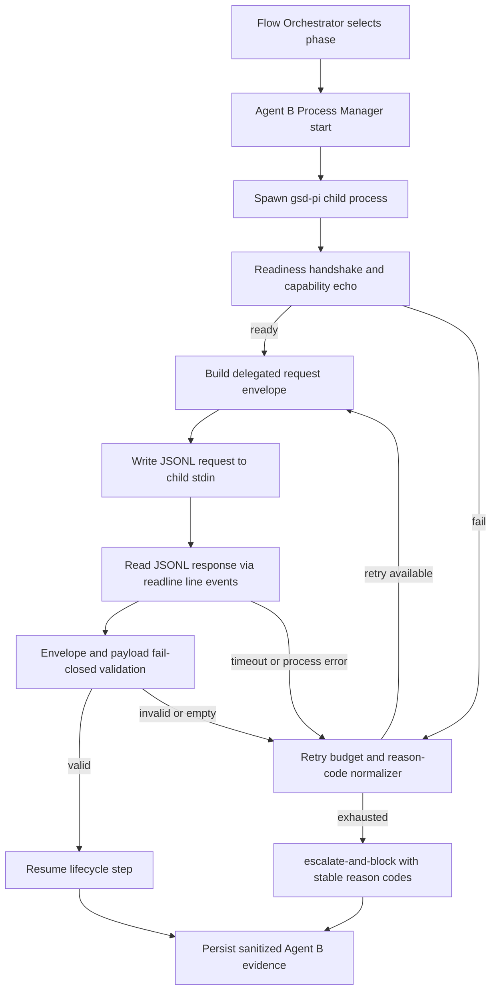

# Phase 9: Independent Agent B Runtime and Two-Round Consensus Slice - Research

**Researched:** 2026-07-19
**Domain:** Separate-process Agent B runtime orchestration for spec/discuss delegation
**Confidence:** MEDIUM

<user_constraints>
## User Constraints (from CONTEXT.md)

### Locked Decisions
- **D-01:** Agent B lifecycle is phase-scoped: start before delegated spec/discuss flow for a phase, stay alive across both workflow surfaces in that phase, terminate after discuss completes.
- **D-02:** Startup readiness requires explicit handshake and capability echo before first delegated question.
- **D-03:** Shutdown is graceful stop with bounded timeout, then force-kill if still alive.
- **D-04:** Per-phase Agent B runtime evidence persists under `flow/runs/<run-id>/agent-b/`.
- **D-05:** IPC transport for phase 9 is stdio JSONL request/response.
- **D-06:** Every exchange uses a strict correlation envelope with explicit `requestType` and deterministic metadata.
- **D-07:** Malformed/schema-invalid responses are treated as retryable transport/protocol failures first, then escalate-and-block on exhaustion.
- **D-08:** Payload supports natural-language free-text answer in a required payload field, while envelope validation remains fail-closed.
- **D-09:** Agent B must load from a dedicated Agent B config path (not shared fallback).
- **D-10:** Missing/invalid Agent B config fails closed at startup with stable startup reason code.
- **D-11:** Logging/evidence uses strict redaction and allowlisted provider metadata only (no secret leakage).
- **D-12:** Tests must inject distinct stub provider/model IDs for A vs B and assert separation via handshake + persisted evidence.
- **D-13:** Retry cap defaults to 2 attempts total for delegated Agent B failures.
- **D-14:** Per-try timeout defaults to 5 minutes.
- **D-15:** Failure reasons use stable namespaced machine-readable reason codes by class.
- **D-16:** Retry exhaustion always emits `escalate-and-block` with both `retry_exhausted` and root-cause reason code.

### Claude's Discretion
- No explicit discretion areas were delegated; implementation is constrained by the locked decisions above.

### Deferred Ideas (OUT OF SCOPE)
- Multi-agent debate/consensus expansion remains deferred to future phases per scope lock.
- Agora transport remains deferred to phase 11.
</user_constraints>

<phase_requirements>
## Phase Requirements

| ID | Description | Research Support |
|----|-------------|------------------|
| INTD-07 | Real separate-process Agent B ask/answer delegation for both `/gsd-spec-phase` and `/gsd-discuss-phase`. [ASSUMED] | Separate process lifecycle, stdio JSONL contract, dedicated config path, and fail-closed response handling patterns are specified in this research. [CITED: .planning/phases/09-independent-agent-b-runtime-and-two-round-consensus-slice/09-SPEC.md] |
| CONS-02 | Deterministic consensus-slice control in Phase 9 is enforced as scope lock: consensus/debate expansion remains disabled/rejected for this phase. [ASSUMED] | Planner should add explicit runtime guardrails to reject consensus/debate/Agora paths and preserve Agent A final authority. [CITED: .planning/phases/09-independent-agent-b-runtime-and-two-round-consensus-slice/09-SPEC.md] |
| VER-05 | End-to-end verification proving independent runtime communication, retries, timeout handling, and fail-closed escalation. [ASSUMED] | Test map and Wave 0 gaps define concrete automated tests and commands for process isolation and failure-path coverage. [VERIFIED: codebase grep] |
</phase_requirements>

## Project Constraints (from CLAUDE.md)

- Reliability over autonomy: outputs must be evidence-backed and verifiable. [CITED: .claude/CLAUDE.md]
- Workflow-first control: deterministic routing/validation owns control flow. [CITED: .claude/CLAUDE.md]
- Compose Pi/GSD boundaries, do not reimplement lifecycle semantics from scratch. [CITED: .claude/CLAUDE.md]
- Root `flow/` remains control-plane implementation surface with thin bridge boundaries. [CITED: .planning/ROADMAP.md]
- Security posture requires fail-closed behavior and no secret leakage in logs/evidence. [CITED: .planning/phases/09-independent-agent-b-runtime-and-two-round-consensus-slice/09-SPEC.md]
- Project skill workflows emphasize preserving workflow gates and end-to-end execution discipline. [CITED: .claude/skills/gsd-ai-integration-phase/SKILL.md] [CITED: .claude/skills/gsd-secure-phase/SKILL.md] [CITED: .claude/skills/gsd-verify-work/SKILL.md]

## Summary

Phase 9 should be planned as a runtime-isolation slice, not a consensus-expansion slice. Current code already has deterministic seams for interception metadata, context-pack construction, answer schema checks, retry policy, and escalation/governance persistence, but Agent B is still conceptual/prototype behavior and not a real independent process boundary. [VERIFIED: codebase grep] The plan should introduce an Agent B process manager and stdio JSONL RPC contract that plugs into existing orchestration/lifecycle seams rather than replacing them. [VERIFIED: codebase grep]

The most important technical risk is boundary failure handling: startup failure, malformed JSONL lines, empty answers, timeout, and process crash must all normalize into bounded retries and deterministic reason codes ending in escalate-and-block on exhaustion. [CITED: .planning/phases/09-independent-agent-b-runtime-and-two-round-consensus-slice/09-CONTEXT.md] Existing fail-closed patterns (`validateDebateEventEnvelope`, `assertValidResponderAnswer`, `runStepWithRetry`, `evaluateEscalation`) provide concrete implementation analogs for this behavior. [VERIFIED: codebase grep]

Environment-wise, Node and pnpm are available, but a globally installed `gsd-pi` CLI is not; fallback through the vendored workspace command path is available (`pnpm --dir external/gsd-pi -s gsd --help`). [VERIFIED: codebase grep] This should be treated as an explicit planner dependency decision to avoid runtime surprises during execution tests. [ASSUMED]

**Primary recommendation:** Build a dedicated Agent B process runtime module (spawn/handshake/request/timeout/retry/shutdown) integrated into existing `flow/orchestrator` and `flow/lifecycle` seams, with explicit scope guards that keep consensus/debate expansion disabled in Phase 9. [VERIFIED: codebase grep]

## Architectural Responsibility Map

| Capability | Primary Tier | Secondary Tier | Rationale |
|------------|-------------|----------------|-----------|
| Spawn and supervise Agent B OS process | Orchestrator | Runtime OS process layer | Process lifecycle and IPC ownership belongs to orchestration boundaries, not governance or phase selection logic. [ASSUMED] |
| Build and send delegated question envelopes | Orchestrator | Lifecycle | Interception/context-pack already originate in orchestrator and are consumed by lifecycle execution paths. [VERIFIED: codebase grep] |
| Validate Agent B response envelope and payload | Lifecycle validation seam | Orchestrator contract helpers | Existing fail-closed validator conventions are in lifecycle; strict response envelope helpers can be orchestrator-shared. [VERIFIED: codebase grep] |
| Retry, timeout, and escalation normalization | Lifecycle retry + Governance escalation | Orchestrator process manager | `runStepWithRetry` and `evaluateEscalation` already provide deterministic policy patterns to reuse. [VERIFIED: codebase grep] |
| Persist Agent B run evidence and sanitized metadata | Governance + run artifact writers | Orchestrator | Governance modules already sanitize provider metadata and append discussion evidence. [VERIFIED: codebase grep] |
| Enforce Phase 9 scope lock (no consensus/debate expansion) | CLI/orchestrator policy gate | Debate prototype seam | Existing prototype path is feature-flagged; Phase 9 path should explicitly reject deferred modes. [VERIFIED: codebase grep] |

## Standard Stack

### Core
| Library | Version | Purpose | Why Standard |
|---------|---------|---------|--------------|
| Node.js runtime | 22+ required by `@opengsd/gsd-pi`, local machine is v24.14.0. [CITED: external/gsd-pi/package.json] [VERIFIED: codebase grep] | Parent/child process control and stream-based IPC. [CITED: https://nodejs.org/docs/latest-v22.x/api/child_process.html] | Native process/stdio APIs avoid extra dependency risk for IPC core path. [CITED: https://nodejs.org/docs/latest-v22.x/api/child_process.html] |
| `node:child_process` | Built-in (Node v22 docs line) [CITED: https://nodejs.org/docs/latest-v22.x/api/child_process.html] | Spawn Agent B, monitor `spawn/error/exit/close`, terminate gracefully/forcefully. [CITED: https://nodejs.org/docs/latest-v22.x/api/child_process.html] | Stable, event-driven lifecycle semantics match D-01..D-03. [CITED: https://nodejs.org/docs/latest-v22.x/api/child_process.html] |
| `node:readline` | Built-in (Node v22 docs line) [CITED: https://nodejs.org/docs/latest-v22.x/api/readline.html] | Parse stdout/stderr as line-oriented JSONL safely. [CITED: https://nodejs.org/docs/latest-v22.x/api/readline.html] | `line` event + `crlfDelay` handling provides deterministic framing across line endings. [CITED: https://nodejs.org/docs/latest-v22.x/api/readline.html] |
| `AbortSignal.timeout` + timers promises | Built-in (Node v22 docs line) [CITED: https://nodejs.org/docs/latest-v22.x/api/globals.html#static-method-abortsignaltimeoutdelay] [CITED: https://nodejs.org/docs/latest-v22.x/api/timers.html#timers-promises-api] | Enforce per-try timeout and cancellation behavior. [CITED: https://nodejs.org/docs/latest-v22.x/api/timers.html#timers-promises-api] | Native cancellation semantics simplify deterministic timeout reason codes. [CITED: https://nodejs.org/docs/latest-v22.x/api/globals.html#class-abortsignal] |

### Supporting
| Library | Version | Purpose | When to Use |
|---------|---------|---------|-------------|
| `node:test` and `node:assert/strict` | Built-in, already used in `flow/tests/*.mjs`. [VERIFIED: codebase grep] | Deterministic unit/integration tests for runtime and failure matrix. [VERIFIED: codebase grep] | Use for all new Phase 9 tests to match existing test harness style. [VERIFIED: codebase grep] |
| Vendored `gsd` command via pnpm | `@opengsd/gsd-pi` 1.11.0 in `external/gsd-pi`, local `pnpm` 10.32.1. [CITED: external/gsd-pi/package.json] [VERIFIED: codebase grep] | Fallback process target when global `gsd-pi` CLI is unavailable. [VERIFIED: codebase grep] | Use in CI/dev where global binary is absent. [ASSUMED] |

### Alternatives Considered
| Instead of | Could Use | Tradeoff |
|------------|-----------|----------|
| stdio JSONL over spawned process | Node IPC channel (`fork` + `process.send`) | IPC channel is Node-specific; stdio JSONL aligns better with explicit process boundary and language-agnostic transport patterns. [ASSUMED] |
| Native child-process APIs only | Third-party process wrappers | Adds dependency surface without clear gain for this constrained slice. [ASSUMED] |

**Installation:**
```bash
# No new package installation is required for Phase 9.
# Use existing runtime + vendored gsd-pi workspace.
```

**Version verification:**
```bash
node --version
npm --version
pnpm --version
```

## Package Legitimacy Audit

No external package installation is recommended for this phase slice; package legitimacy gate is not required unless planner introduces a new dependency. [ASSUMED]

| Package | Registry | Age | Downloads | Source Repo | Verdict | Disposition |
|---------|----------|-----|-----------|-------------|---------|-------------|
| none | n/a | n/a | n/a | n/a | n/a | No new package install in recommended plan |

**Packages removed due to [SLOP] verdict:** none
**Packages flagged as suspicious [SUS]:** none

## Architecture Patterns

### System Architecture Diagram



### Recommended Project Structure

```text
flow/
├── orchestrator/
│   ├── agent-b-runtime.mjs           # spawn/handshake/request/response/shutdown manager [ASSUMED]
│   ├── agent-b-protocol.mjs          # JSONL envelope encode/decode + correlation checks [ASSUMED]
│   ├── context-pack.mjs              # existing deterministic context pack seam [VERIFIED: codebase grep]
│   └── interception.mjs              # existing delegation metadata seam [VERIFIED: codebase grep]
├── lifecycle/
│   ├── answer-schema.mjs             # existing fail-closed payload validator [VERIFIED: codebase grep]
│   └── retry-policy.mjs              # existing bounded retry helper [VERIFIED: codebase grep]
├── governance/
│   ├── discussion-log.mjs            # sanitized provider metadata persistence [VERIFIED: codebase grep]
│   └── escalation-policy.mjs         # deterministic escalation gate pattern [VERIFIED: codebase grep]
└── tests/
    ├── orchestrator-agent-b-runtime.test.mjs    # new phase-9 process lifecycle tests [ASSUMED]
    ├── orchestrator-agent-b-protocol.test.mjs   # new envelope/correlation tests [ASSUMED]
    └── lifecycle-agent-b-delegation-e2e.test.mjs# new spec+discuss end-to-end slice tests [ASSUMED]
```

### Pattern 1: Process Lifecycle Contract
**What:** Start Agent B once per phase, require startup handshake, keep process alive through spec+discuss, and perform graceful shutdown then force-kill on timeout. [CITED: .planning/phases/09-independent-agent-b-runtime-and-two-round-consensus-slice/09-CONTEXT.md]
**When to use:** Any delegated round in Phase 9 where Agent B must be a true isolated OS process. [CITED: .planning/phases/09-independent-agent-b-runtime-and-two-round-consensus-slice/09-SPEC.md]
**Example:**
```javascript
// Source: Node child_process lifecycle docs
import { spawn } from "node:child_process";

const child = spawn("node", ["agent-b-entry.mjs"], {
  stdio: ["pipe", "pipe", "pipe"],
  env: { ...process.env, AGENT_ROLE: "agent-b" },
});

child.once("error", onSpawnError);
child.once("spawn", onSpawned);
child.once("close", onClosed);
```

### Pattern 2: Strict JSONL Correlation Envelope
**What:** Each request/response line carries `schemaVersion`, `requestType`, `correlationId`, and machine-readable status fields; malformed lines are normalized to retryable protocol failures first. [CITED: .planning/phases/09-independent-agent-b-runtime-and-two-round-consensus-slice/09-CONTEXT.md]
**When to use:** All stdio JSONL messages between Agent A and Agent B. [CITED: .planning/phases/09-independent-agent-b-runtime-and-two-round-consensus-slice/09-SPEC.md]
**Example:**
```javascript
// Source: repository fail-closed validator pattern
function parseJsonlLine(line) {
  try {
    return JSON.parse(line);
  } catch {
    const err = new Error("malformed_jsonl_line");
    err.retryable = true;
    throw err;
  }
}
```

### Pattern 3: Timeout + Retry + Exhaustion Escalation
**What:** Enforce per-try timeout with `AbortSignal.timeout`, retry up to configured cap, then emit `escalate-and-block` with both `retry_exhausted` and root-cause reason code. [CITED: .planning/phases/09-independent-agent-b-runtime-and-two-round-consensus-slice/09-CONTEXT.md] [CITED: https://nodejs.org/docs/latest-v22.x/api/globals.html#static-method-abortsignaltimeoutdelay]
**When to use:** Every delegated ask/answer round to Agent B process. [CITED: .planning/phases/09-independent-agent-b-runtime-and-two-round-consensus-slice/09-SPEC.md]
**Example:**
```javascript
// Source: Node AbortSignal + retry-policy pattern
const signal = AbortSignal.timeout(timeoutMs);
try {
  await waitForResponse({ signal });
} catch (error) {
  // mark retryable timeout/protocol failures before exhaustion gate
}
```

### Anti-Patterns to Avoid
- **Silent in-process fallback:** Never route to same-process responder when Agent B startup fails. [CITED: .planning/phases/09-independent-agent-b-runtime-and-two-round-consensus-slice/09-SPEC.md]
- **Unbounded child lifetime:** Leaving child process alive past phase completion causes leakage and non-determinism. [ASSUMED]
- **Raw provider payload logging:** Persisting raw provider bodies/secrets violates existing allowlist sanitization posture. [VERIFIED: codebase grep]
- **Consensus creep in Phase 9:** Enabling debate/consensus behavior contradicts locked scope. [CITED: .planning/phases/09-independent-agent-b-runtime-and-two-round-consensus-slice/09-SPEC.md]

## Don't Hand-Roll

| Problem | Don't Build | Use Instead | Why |
|---------|-------------|-------------|-----|
| Process supervision primitives | Custom pseudo-process abstraction | Native `child_process.spawn` event model | Native events (`spawn/error/exit/close`) are explicit and already stable. [CITED: https://nodejs.org/docs/latest-v22.x/api/child_process.html] |
| Line framing parser from byte chunks | Manual chunk splitter state machine | `readline.createInterface({ input, crlfDelay: Infinity })` | Standard line handling reduces framing bugs across newline variants. [CITED: https://nodejs.org/docs/latest-v22.x/api/readline.html] |
| Timeout cancellation protocol | Ad-hoc flags + setTimeout races | `AbortSignal.timeout` and abort-aware wait paths | Better determinism and clearer failure semantics. [CITED: https://nodejs.org/docs/latest-v22.x/api/globals.html#static-method-abortsignaltimeoutdelay] |
| Security log filtering | New redaction format | Existing `sanitizeProviderMetadata` allowlist model | Existing governance seam already implements provider metadata allowlisting. [VERIFIED: codebase grep] |

**Key insight:** Phase 9 is mostly composition work across existing deterministic seams; adding new framework dependencies is lower value than tightening process-boundary contracts and tests. [VERIFIED: codebase grep]

## Common Pitfalls

### Pitfall 1: Treating process spawn success as readiness
**What goes wrong:** Child process exists but cannot serve delegated requests yet. [ASSUMED]
**Why it happens:** Using PID presence instead of handshake/capability echo as readiness gate. [ASSUMED]
**How to avoid:** Enforce explicit startup handshake before first delegated question (D-02). [CITED: .planning/phases/09-independent-agent-b-runtime-and-two-round-consensus-slice/09-CONTEXT.md]
**Warning signs:** First request fails intermittently right after spawn. [ASSUMED]

### Pitfall 2: JSONL protocol drift
**What goes wrong:** Parent and child disagree on field names or envelope schema version. [ASSUMED]
**Why it happens:** No shared strict validator for `requestType`/`correlationId`/`schemaVersion`. [ASSUMED]
**How to avoid:** Validate every inbound line fail-closed and map malformed responses to retryable protocol errors first (D-07). [CITED: .planning/phases/09-independent-agent-b-runtime-and-two-round-consensus-slice/09-CONTEXT.md]
**Warning signs:** Frequent malformed payload reason codes and retry exhaustion on healthy provider responses. [ASSUMED]

### Pitfall 3: Incomplete shutdown semantics
**What goes wrong:** Zombie child processes or hung test runs. [ASSUMED]
**Why it happens:** Missing graceful-then-force kill sequence with bounded timeout. [CITED: .planning/phases/09-independent-agent-b-runtime-and-two-round-consensus-slice/09-CONTEXT.md]
**How to avoid:** Implement D-03 exactly, assert close/exit event completion in tests. [CITED: .planning/phases/09-independent-agent-b-runtime-and-two-round-consensus-slice/09-CONTEXT.md]
**Warning signs:** Intermittent CI hangs and non-deterministic port/process cleanup failures. [ASSUMED]

## Code Examples

Verified patterns from official and local sources:

### Spawn with explicit stdio and lifecycle listeners
```javascript
// Source: https://nodejs.org/docs/latest-v22.x/api/child_process.html
import { spawn } from "node:child_process";

const cp = spawn("node", ["agent-b-entry.mjs"], {
  stdio: ["pipe", "pipe", "pipe"],
  env: { ...process.env, AGENT_B_CONFIG_PATH: "/path/to/agent-b-config" },
});

cp.once("spawn", () => {
  // safe point to begin handshake
});
cp.once("error", (err) => {
  // spawn or kill/send failures
});
cp.once("close", (code, signal) => {
  // stdio fully closed
});
```

### JSONL line ingestion with deterministic framing
```javascript
// Source: https://nodejs.org/docs/latest-v22.x/api/readline.html
import readline from "node:readline";

const rl = readline.createInterface({
  input: child.stdout,
  crlfDelay: Infinity,
});

rl.on("line", (line) => {
  const message = JSON.parse(line);
  onProtocolMessage(message);
});
```

### Retry policy pattern already used in Flow
```javascript
// Source: flow/lifecycle/retry-policy.mjs
import { runStepWithRetry } from "../lifecycle/retry-policy.mjs";

const execution = await runStepWithRetry({
  step: "discuss",
  policy: { maxRetries: 1, retryableSteps: ["discuss"] },
  runner: async () => delegatedAskAnswer(),
});
```

## State of the Art

| Old Approach | Current Approach | When Changed | Impact |
|--------------|------------------|--------------|--------|
| Prototype-only Agent B behavior in in-process orchestration path. [VERIFIED: codebase grep] | Real separate-process Agent B runtime target for spec/discuss delegation. [CITED: .planning/phases/09-independent-agent-b-runtime-and-two-round-consensus-slice/09-SPEC.md] | Locked for Phase 9 on 2026-07-19. [CITED: .planning/phases/09-independent-agent-b-runtime-and-two-round-consensus-slice/09-SPEC.md] | Requires lifecycle-safe process management, protocol hardening, and new end-to-end tests. [ASSUMED] |
| Optional prototype debate path in CLI (`--phase8-debate-prototype`). [VERIFIED: codebase grep] | Phase 9 preserves scope lock: consensus/debate expansion is deferred and must be rejected/disabled. [CITED: .planning/phases/09-independent-agent-b-runtime-and-two-round-consensus-slice/09-SPEC.md] | Scope clarified in Phase 9 spec/context. [CITED: .planning/phases/09-independent-agent-b-runtime-and-two-round-consensus-slice/09-CONTEXT.md] | Planner must avoid debate feature work in this phase. [ASSUMED] |

**Deprecated/outdated:**
- Treating Agent B as metadata-only route concept is outdated for Phase 9 success criteria. [CITED: .planning/phases/09-independent-agent-b-runtime-and-two-round-consensus-slice/09-SPEC.md]

## Assumptions Log

| # | Claim | Section | Risk if Wrong |
|---|-------|---------|---------------|
| A1 | Requirement IDs `INTD-07`, `CONS-02`, `VER-05` descriptions are roadmap/spec-defined but not expanded in global `REQUIREMENTS.md`. | Phase Requirements | Planner could mis-map acceptance checks if taxonomy is updated elsewhere. |
| A2 | `CONS-02` for this phase should be satisfied by explicit consensus/debate disablement guardrails per scope lock. | Phase Requirements, Architecture Patterns | Could under-deliver if stakeholders expect partial consensus execution in Phase 9. |
| A3 | New test filenames proposed in project structure (`orchestrator-agent-b-runtime.test.mjs`, etc.) are recommendations, not pre-existing files. | Recommended Project Structure, Validation Architecture | Planner may need to rename tasks/files to match team conventions. |
| A4 | Using vendored `pnpm --dir external/gsd-pi -s gsd` as fallback is acceptable in CI/dev where global `gsd-pi` is missing. | Standard Stack, Environment Availability | Execution may fail if fallback policy prefers globally installed binaries only. |

## Open Questions

1. **Agent B launch target contract**
   - What we know: Global `gsd-pi` binary is missing, vendored pnpm command path is available. [VERIFIED: codebase grep]
   - What's unclear: Should planner require global binary install or lock to vendored invocation only.
   - Recommendation: Decide one canonical launch path in Wave 0 and enforce via integration tests.

2. **Scope-lock reason code naming**
   - What we know: Phase 9 must reject/disable consensus/debate and Agora paths. [CITED: .planning/phases/09-independent-agent-b-runtime-and-two-round-consensus-slice/09-SPEC.md]
   - What's unclear: Exact reason-code namespace for scope violations (e.g., `scope.phase9_consensus_disabled`).
   - Recommendation: Define reason-code catalog early and freeze in tests before implementation.

3. **Agent B config schema location**
   - What we know: Dedicated config path is mandatory and must fail closed when invalid. [CITED: .planning/phases/09-independent-agent-b-runtime-and-two-round-consensus-slice/09-CONTEXT.md]
   - What's unclear: Whether config schema should be in `flow/orchestrator` or shared with external `gsd-pi` assets.
   - Recommendation: Place schema ownership at Flow boundary but validate compatibility against vendored gsd-pi docs/code in Wave 0.

## Environment Availability

| Dependency | Required By | Available | Version | Fallback |
|------------|------------|-----------|---------|----------|
| `node` | Parent orchestrator + child process runtime | ✓ | v24.14.0 | — |
| `npm` | Toolchain parity / optional scripts | ✓ | 11.9.0 | — |
| `pnpm` | Vendored `external/gsd-pi` execution path | ✓ | 10.32.1 | — |
| Global `gsd-pi` CLI | Direct child launch target (if chosen) | ✗ | — | Use `pnpm --dir external/gsd-pi -s gsd ...` |
| Vendored `@opengsd/gsd-pi` workspace | Separate Agent B runtime implementation target | ✓ | 1.11.0 (workspace package) | — |

**Missing dependencies with no fallback:**
- none

**Missing dependencies with fallback:**
- Global `gsd-pi` CLI (fallback: vendored pnpm command path)

## Validation Architecture

### Test Framework
| Property | Value |
|----------|-------|
| Framework | Node built-in `node:test` + `node:assert/strict` [VERIFIED: codebase grep] |
| Config file | none (direct `node --test` invocation pattern) [VERIFIED: codebase grep] |
| Quick run command | `node --test flow/tests/orchestrator-context-pack.test.mjs flow/tests/lifecycle-retry.test.mjs flow/tests/governance-discussion-log.test.mjs` |
| Full suite command | `node --test flow/tests/*.mjs` |

### Phase Requirements -> Test Map
| Req ID | Behavior | Test Type | Automated Command | File Exists? |
|--------|----------|-----------|-------------------|-------------|
| INTD-07 | Separate-process Agent B start/handshake/ask/answer for both spec and discuss | integration | `node --test flow/tests/orchestrator-agent-b-runtime.test.mjs` | ❌ Wave 0 |
| CONS-02 | Consensus/debate/Agora paths are explicitly rejected/disabled in Phase 9 runtime scope | unit/integration | `node --test flow/tests/orchestrator-agent-b-scope-lock.test.mjs` | ❌ Wave 0 |
| VER-05 | Timeout/retry exhaustion/fail-closed escalation with stable reason codes | integration | `node --test flow/tests/lifecycle-agent-b-delegation-e2e.test.mjs` | ❌ Wave 0 |

### Sampling Rate
- **Per task commit:** `node --test flow/tests/orchestrator-agent-b-*.test.mjs`
- **Per wave merge:** `node --test flow/tests/orchestrator-agent-b-*.test.mjs flow/tests/lifecycle-*.test.mjs flow/tests/governance-*.test.mjs`
- **Phase gate:** `node --test flow/tests/*.mjs` must be green before `/gsd-verify-work`

### Wave 0 Gaps
- [ ] `flow/tests/orchestrator-agent-b-runtime.test.mjs` - process lifecycle, handshake, dedicated config path checks
- [ ] `flow/tests/orchestrator-agent-b-scope-lock.test.mjs` - consensus/debate/Agora rejection assertions
- [ ] `flow/tests/lifecycle-agent-b-delegation-e2e.test.mjs` - spec+discuss end-to-end delegated ask/answer with retries/timeouts
- [ ] Shared test fixtures for stubbed Agent A/B provider-model identities and deterministic reason-code assertions

## Security Domain

### Applicable ASVS Categories

| ASVS Category | Applies | Standard Control |
|---------------|---------|-----------------|
| V2 Authentication | no | Phase 9 scope is process delegation, not user identity auth. [ASSUMED] |
| V3 Session Management | no | No user/web session lifecycle in this slice. [ASSUMED] |
| V4 Access Control | yes | Enforce role boundary (Agent A authority, Agent B answer-only) and scope-lock policy guards. [CITED: .planning/phases/09-independent-agent-b-runtime-and-two-round-consensus-slice/09-SPEC.md] |
| V5 Input Validation | yes | Fail-closed payload/envelope validation via existing lifecycle/orchestrator validator patterns. [VERIFIED: codebase grep] |
| V6 Cryptography | no (directly) | No new cryptographic protocol in this phase; avoid introducing custom crypto. [ASSUMED] |

### Known Threat Patterns for Node child-process + JSONL IPC

| Pattern | STRIDE | Standard Mitigation |
|---------|--------|---------------------|
| Command injection via process launch arguments | Tampering/Elevation | Use spawn without `shell: true`; never pass unsanitized user input into command strings. [CITED: https://nodejs.org/docs/latest-v22.x/api/child_process.html] |
| Malformed protocol payload causes unsafe continuation | Tampering | Strict envelope validation + fail-closed retry/exhaustion escalation path. [CITED: .planning/phases/09-independent-agent-b-runtime-and-two-round-consensus-slice/09-CONTEXT.md] |
| Secret leakage in logs/evidence | Information disclosure | Persist allowlisted provider metadata only (`sanitizeProviderMetadata` pattern). [VERIFIED: codebase grep] |
| Zombie child processes after phase completion | Availability | Graceful-stop then force-kill with bounded timeout and close-event confirmation. [CITED: .planning/phases/09-independent-agent-b-runtime-and-two-round-consensus-slice/09-CONTEXT.md] |
| Cross-run state contamination in runtime artifacts | Tampering | Preserve per-run/per-phase isolation paths under `flow/runs/<run-id>/...`. [VERIFIED: codebase grep] |

## Sources

### Primary (HIGH confidence)
- Repository code inspection (`flow/cli.mjs`, `flow/orchestrator/*.mjs`, `flow/lifecycle/*.mjs`, `flow/governance/*.mjs`, `flow/tests/*.mjs`) - current deterministic seams, validation style, and governance patterns. [VERIFIED: codebase grep]
- Phase lock artifacts (`09-SPEC.md`, `09-CONTEXT.md`, `.planning/ROADMAP.md`) - scope, constraints, acceptance targets, and deferred boundaries. [CITED: .planning/phases/09-independent-agent-b-runtime-and-two-round-consensus-slice/09-SPEC.md]

### Secondary (MEDIUM confidence)
- none (Context7 unavailable in this environment)

### Tertiary (LOW confidence)
- Node.js docs fetched through webfetch fallback provider for `child_process`, `readline`, `globals`, `timers`. [CITED: https://nodejs.org/docs/latest-v22.x/api/child_process.html] [CITED: https://nodejs.org/docs/latest-v22.x/api/readline.html] [CITED: https://nodejs.org/docs/latest-v22.x/api/globals.html] [CITED: https://nodejs.org/docs/latest-v22.x/api/timers.html]
- Websearch seam item for JSONL best practices was unavailable due missing Brave API key. [VERIFIED: codebase grep]

## Metadata

**Confidence breakdown:**
- Standard stack: MEDIUM - Strong local code evidence and official Node docs, but docs provider channel in this run was low-confidence fallback.
- Architecture: HIGH - Directly grounded in locked phase decisions and existing module seams.
- Pitfalls: MEDIUM - Mostly code-grounded, with some operational assumptions around CI/runtime policy.

**Research date:** 2026-07-19
**Valid until:** 2026-08-18
