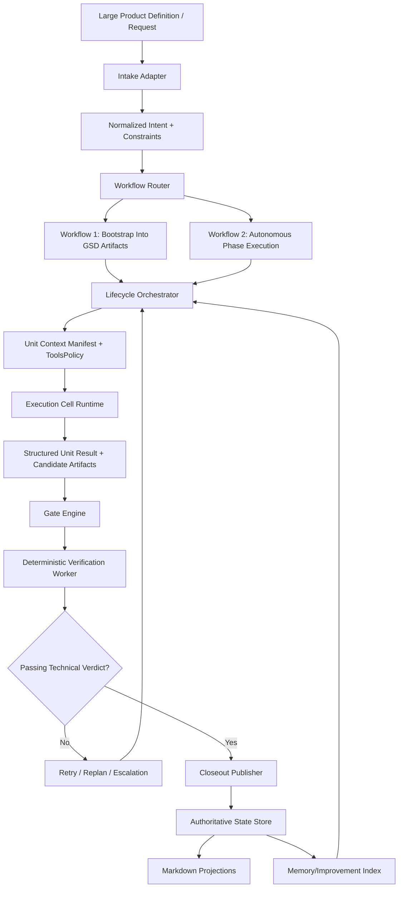

# Architecture Patterns

**Domain:** General-purpose autonomous coding platform / software development factory (Pi + GSD)
**Project:** Flow
**Researched:** 2026-07-17
**Confidence:** MEDIUM (high on GSD lifecycle primitives, medium on public Pi internals)

## Recommended Architecture

Flow should use a split-plane architecture:

- Control Plane: deterministic orchestration, routing, validation, persistence, and policy.
- Execution Plane: bounded agent reasoning and code-changing work inside isolated cells.

This preserves Flow's workflow-first thesis:

1. deterministic code decides what happens and when,
2. agents decide how to implement inside strict contracts,
3. state transitions publish only after evidence-backed verification.

## Plane Split

### Control Plane (authoritative)

Responsibilities:

- Intake and normalization of large product-definition input.
- Workflow router (bootstrap workflow vs phase-execution workflow).
- Lifecycle orchestrator for discuss -> plan -> execute -> verify -> closeout.
- Gate engine (preflight, verification, escalation, abort, retry-budget).
- Runtime state authority and checkpointing.
- Artifact projection and memory indexing.
- Policy enforcement (tool policy, trust boundaries, dangerous action gates).

Should own:

- Workflow state machine transitions.
- Durable record of milestone/slice/task/attempt lineage.
- Idempotency keys for retries/re-dispatch.
- Verification verdict publication rules.

Should never delegate to agent:

- Canonical state transitions.
- Retry budget policy.
- Privileged action approval.
- Completion publication without passing evidence.

### Execution Plane (bounded)

Responsibilities:

- Run unit prompts with context focused on the current unit.
- Perform coding/planning/research actions allowed by unit tool policy.
- Emit structured result payloads and evidence references.
- Return control to host for deterministic post-unit verification.

Should own:

- In-unit reasoning and task implementation details.
- Local command execution under policy constraints.
- Task-level artifact generation.

Should never own:

- Final publication of task/milestone completion.
- Cross-unit scheduling decisions.
- Global lifecycle mutation.

## Major Components And Boundaries

| Component | Plane | Responsibility | Boundary Rule |
|-----------|-------|----------------|---------------|
| Intake Adapter | Control | Parse large markdown/product docs into normalized intent model | Treat all source text as untrusted input; no direct state mutation before schema validation |
| Workflow Router | Control | Select workflow type and route to correct lifecycle entrypoint | Routing is deterministic policy code, not prompt heuristics |
| Lifecycle Orchestrator | Control | Drive discuss/plan/execute/verify sequence and transitions | Only this component can change canonical lifecycle status |
| Gate Engine | Control | Apply preflight, verification, retry, escalation, abort rules | Gate results are machine-readable and persisted before next dispatch |
| State Authority (DB + projections) | Control | Persist authoritative runtime data and render markdown projections | DB is source of truth; markdown files are projections/review surfaces |
| Memory/Improvement Layer | Control | Store decisions/patterns/gotchas, replay into future units, and track quality signals | Memory writes require provenance links to unit/run/evidence |
| Policy/Trust Layer | Control | Tool policy, sandbox policy, dangerous command/merge/deploy gates | Fail closed on policy violations |
| Dispatcher | Control -> Execution boundary | Create unit context manifest and launch execution units | Unit contract is explicit (tools, writable paths, required output) |
| Execution Cell Runtime | Execution | Run bounded agent session (plan/execute/research/doc modes) | No direct write to authoritative state store |
| Verification Worker | Control | Run deterministic checks and attach evidence | Must run after execution result; required before completion publish |
| Closeout Publisher | Control | Commit completion, update projections, and emit audit event | Publish only if current source revision still matches verified evidence |

## Data Flow

## Workflow Mapping To Initial Scope

### Workflow 1: Large-file project bootstrap -> GSD artifacts

Control-plane sequence:

1. Ingest and normalize large markdown.
2. Extract product intent, constraints, requirements, anti-goals, and candidate milestones.
3. Run schema + contradiction checks.
4. Generate/extend project artifacts and phase scaffolding.
5. Validate projection completeness (required files and sections).
6. Publish only after artifact and consistency checks pass.

Execution-plane role:

- Specialized extraction/planning units generate candidate content.
- All writes outside allowed planning paths are blocked.

### Workflow 2: Autonomous roadmap phase execution via GSD lifecycle

Control-plane sequence:

1. Select active phase/slice based on state and dependencies.
2. Dispatch discuss/plan units under planning policy.
3. Dispatch execute-task units under full execution policy in isolated cells.
4. Run deterministic verification and evidence capture.
5. Apply bounded recovery/escalation on failures.
6. Publish completion and update roadmap/state/memory.

Execution-plane role:

- Implement tasks and produce outputs/evidence pointers.
- Never finalize lifecycle status.

## Architecture Patterns To Follow

### Pattern 1: Host-Authoritative Lifecycle

What:

- Runtime host owns lifecycle and task status transitions.

When:

- Always; especially for retries, reopen/recovery, and completion publication.

Why:

- Prevents prompt drift from mutating project truth.

### Pattern 2: Unit Contract + Tools Policy

What:

- Every dispatched unit includes a contract: allowed tools, writable scope, expected artifacts, and required output schema.

When:

- Before each unit dispatch.

Why:

- Enforces bounded autonomy and reduces blast radius.

### Pattern 3: Evidence-First Completion

What:

- Completion requires current-source, passing technical verdict with stored evidence.

When:

- After every execute unit and before task/milestone publication.

Why:

- Reliability is the product; existence-only checks are insufficient.

### Pattern 4: Projection Is Not Authority

What:

- Markdown is review/projection; authoritative state is durable runtime store.

When:

- Always, including crash recovery and resumptions.

Why:

- Eliminates state divergence and non-deterministic rebuild from markdown edits.

### Pattern 5: Isolated Execution Cells

What:

- Code-mutating units run in isolated git/worktree boundaries.

When:

- Execute units and parallel waves.

Why:

- Prevents cross-task contamination and enables safe concurrency.

### Pattern 6: Bounded Recovery With Lineage

What:

- Failures create lineage-linked attempts with explicit retry budgets.

When:

- Provider errors, verification failures, interruptions.

Why:

- Gives durable recovery without infinite loops.

## Anti-Patterns To Avoid

### Anti-Pattern 1: Prompt-Driven Router

What:

- Letting prompt text choose workflow and state transitions.

Why bad:

- Non-deterministic behavior, hard-to-debug regressions, weak replayability.

Instead:

- Deterministic routing code + persisted rationale.

### Anti-Pattern 2: Agent-Published Completion

What:

- Agent marks work complete directly.

Why bad:

- False-green outcomes and unverifiable state.

Instead:

- Host publishes completion only after gate+verification success.

### Anti-Pattern 3: Markdown-As-Truth Runtime

What:

- Reconstructing authoritative runtime state from files by default.

Why bad:

- Drift, corruption risk, and replay ambiguity.

Instead:

- DB/state store authority with explicit import/recovery flows.

### Anti-Pattern 4: Unlimited Self-Healing Loops

What:

- Infinite retry/replan loops on stubborn failures.

Why bad:

- Cost burn and hidden deadlocks.

Instead:

- Retry budgets, escalate-after-N, and stop conditions.

## Suggested Build Order

1. Runtime state authority and lifecycle kernel
- Implement canonical entities and transitions for project/milestone/slice/task/attempt.
- Add idempotency and checkpoint model first.

2. Unit contract + policy enforcement
- Implement unit manifest compiler and hard policy checks.
- Block unsafe writes/commands and enforce writable scopes.

3. Workflow 1 (bootstrap pipeline)
- Build ingestion, normalization, extraction, artifact generation, and projection verification.
- Gate publish on schema + consistency checks.

4. Workflow 2 (phase execution pipeline)
- Implement discuss/plan/execute/verify orchestration.
- Add attempt lineage and deterministic post-unit closeout.

5. Verification control loop
- Add deterministic command verification, verdict model, evidence storage.
- Enforce current-source match before completion publish.

6. Execution cell isolation + safe parallelism
- Add worktree/cell isolation and dependency-aware parallel execution.
- Add conflict/base guards with degrade-to-sequential fallback.

7. Memory/improvement layer
- Store decisions/patterns/gotchas with provenance.
- Inject memory into planning units and track impact metrics.

8. Intake/router expansion for additional workflow types
- Add feature/bugfix/chore/hotfix routing once two core workflows are stable.

## Architectural Risks And Tradeoffs

| Risk / Tradeoff | Why It Matters | Direction |
|-----------------|----------------|-----------|
| SQLite/local-first authority scales poorly cross-host | Strong single-host reliability but limited distributed coordination | Keep local-first for v1; plan explicit external coordinator for multi-host future |
| Deterministic control reduces flexibility | Hard boundaries can slow experimentation | Preserve extension points at unit level, not in lifecycle authority |
| Strict policy can block legitimate edge cases | False-positive policy blocks can hurt throughput | Add audited override path with explicit operator action and provenance |
| Evidence-first verification increases latency/cost | More checks per task reduce speed | Accept this tradeoff initially; optimize with selective verification tiers later |
| Worktree isolation improves safety but adds git complexity | Merge/conflict overhead rises with parallelism | Introduce parallelism gradually with conflict-aware scheduling |
| Projection model can confuse users expecting file edits to be authoritative | Mental model mismatch causes accidental drift edits | Surface clear UI/status warnings: projection vs authority |
| Memory layer can accumulate low-signal noise | Bad memory retrieval degrades planning quality | Require provenance and confidence tagging; periodically prune/compact |
| Router expansion too early can fragment reliability effort | Too many workflows dilute core quality | Hold expansion until bootstrap + phase-execution reliability KPIs pass |

## Scalability Considerations

| Concern | At 100 users | At 10K users | At 1M users |
|---------|--------------|--------------|-------------|
| Orchestration throughput | Single-host control runtime with bounded workers | Partition by project/workspace and shard runners | Multi-region orchestration with explicit distributed coordinator |
| Verification load | Inline checks in host post-unit loop | Dedicated verification workers and queueing | Tiered verification + probabilistic sampling for low-risk tasks |
| State storage | Local DB + projections | Managed DB with strict migration discipline | Multi-tenant partitioning, archival tiers, and compliance boundaries |
| Parallel execution | Limited wave parallelism | Dependency graph scheduling + cell pools | Global scheduler, quota enforcement, and fairness controls |
| Recovery/forensics | Local logs and unit journals | Centralized observability + run-level traces | Cross-region observability federation and anomaly automation |
| Memory quality | Manual review of key memories | Automated scoring and conflict detection | Memory governance with policy, retention, and lineage analytics |

## Architecture Decision Summary

- Flow should be built as a host-authoritative state machine with bounded execution cells.
- Control-plane determinism plus execution-plane reasoning is the core reliability pattern.
- Publish-on-evidence is the non-negotiable release invariant.
- Build order must prioritize lifecycle authority and policy enforcement before autonomy expansion.

## Sources

- .planning/PROJECT.md
- https://github.com/open-gsd/gsd-core
- https://raw.githubusercontent.com/open-gsd/gsd-core/main/docs/explanation/context-engineering.md
- https://raw.githubusercontent.com/open-gsd/gsd-core/main/docs/INVENTORY.md
- https://raw.githubusercontent.com/open-gsd/gsd-core/main/docs/reference/capability-manifest.md
- https://github.com/open-gsd/gsd-pi
- https://raw.githubusercontent.com/open-gsd/gsd-pi/main/README.md
- https://raw.githubusercontent.com/open-gsd/gsd-pi/main/docs/user-docs/auto-mode.md
